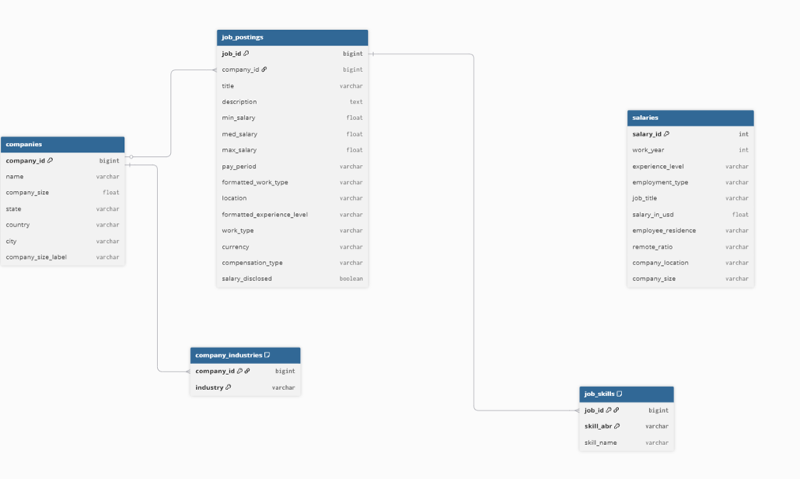

# JobPulse — LinkedIn Job Market Analytics Platform

## Overview
JobPulse is a data analytics and data engineering project that analyzes LinkedIn job postings and salary datasets to uncover hiring trends, salary benchmarks, industry demand, workforce patterns, and skill requirements.

The project follows a complete data pipeline consisting of data extraction, cleaning, transformation, storage in MySQL, SQL-based analytics, and visualization.

---

## Objectives

- Analyze job market trends across industries
- Identify the most in-demand skills
- Study salary patterns across experience levels
- Understand hiring behavior of companies
- Compare work types such as Full-time, Contract, and Part-time
- Explore salary transparency across industries
- Build an end-to-end data analytics workflow using Python and MySQL

---

## Features

### ETL Pipeline
- Data extraction from CSV datasets
- Data cleaning and preprocessing
- Missing value handling
- Data standardization and normalization

### Database Design
- Normalized relational schema
- Primary and Foreign Key constraints
- ER Diagram with cardinality
- Multi-table relationships

### Analytics
- Industry hiring analysis
- Salary benchmarking
- Skill demand analysis
- Experience-level analytics
- Salary transparency analysis
- Company hiring insights

### Visualization
- Highest Paying Jobs
- Remote Work Distribution
- Job Type Distribution
- Experience Level Demand
- Salary Disclosure Analytics

---

## Dataset Information

### LinkedIn Dataset
Contains:
- Job Postings
- Company Information
- Industry Information
- Skills Mapping

### Salary Dataset
Contains:
- Salary information
- Experience levels
- Employment types
- Remote work details
- Company locations

---

## Database Schema

The project consists of 5 tables:

### companies
Stores company information.

### job_postings
Stores LinkedIn job postings.

### company_industries
Maps companies to industries.

### job_skills
Maps job postings to required skills.

### salaries
Stores salary survey information.

---

## ER Diagram



---

## Project Workflow

Raw CSV Files
↓
Data Cleaning (Pandas)
↓
Data Transformation
↓
MySQL Database Loading
↓
SQL Analytics Queries
↓
Visualization & Insights
↓
Business Intelligence

---

## Key Insights

- Information Technology and Software industries dominate hiring.
- Full-time jobs account for the majority of job postings.
- Salary transparency remains relatively low across industries.
- Executive-level professionals earn significantly more than entry-level employees.
- Certain skills consistently appear across multiple experience levels.

---

## Tech Stack

- Python
- Pandas
- NumPy
- Matplotlib
- MySQL
- Jupyter Notebook
- SQL

---

## Project Structure

```text
JobPulse/
├── data/
│   ├── raw/
│   └── cleaned/
├── docs/
│   ├── er_diagram.pdf
│   └── er_diagram.png
├── notebooks/
│   ├── etl_cleaning.ipynb
│   ├── linkedin_cleaning.ipynb
│   ├── mysql_loading.ipynb
│   └── visualization_analysis.ipynb
├── screenshots/
├── sql/
│   ├── database_schema.sql
│   └── analytics_queries.sql
├── README.md
└── requirements.txt
----

---
Author

Komal Gupta

B.Tech — Electrical and Electronics Engineering
MS Ramaiah Institute of Technology

GitHub:https://github.com/Komal1704/JobPulse-Analytics-Platform